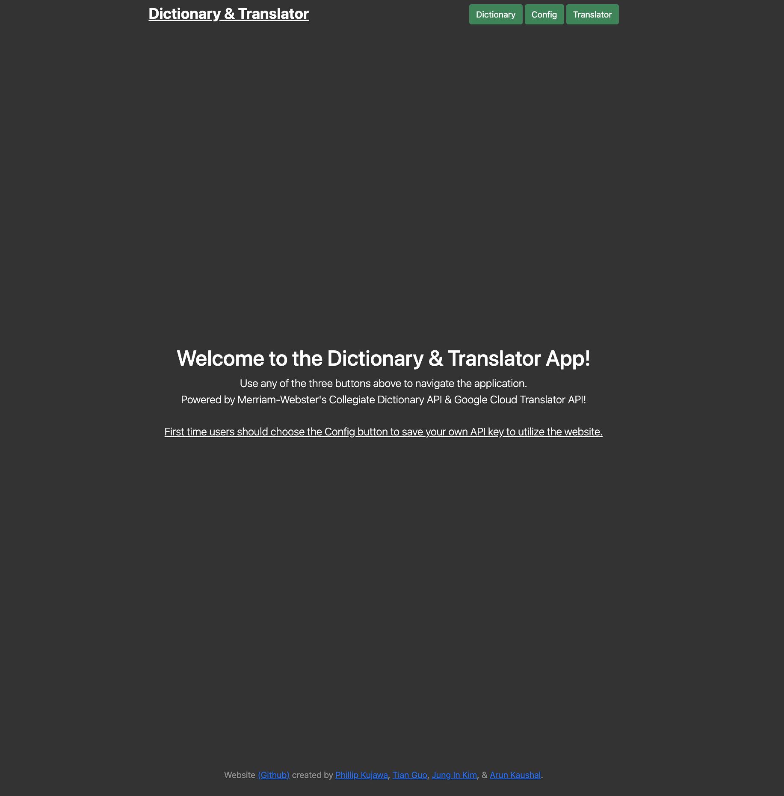
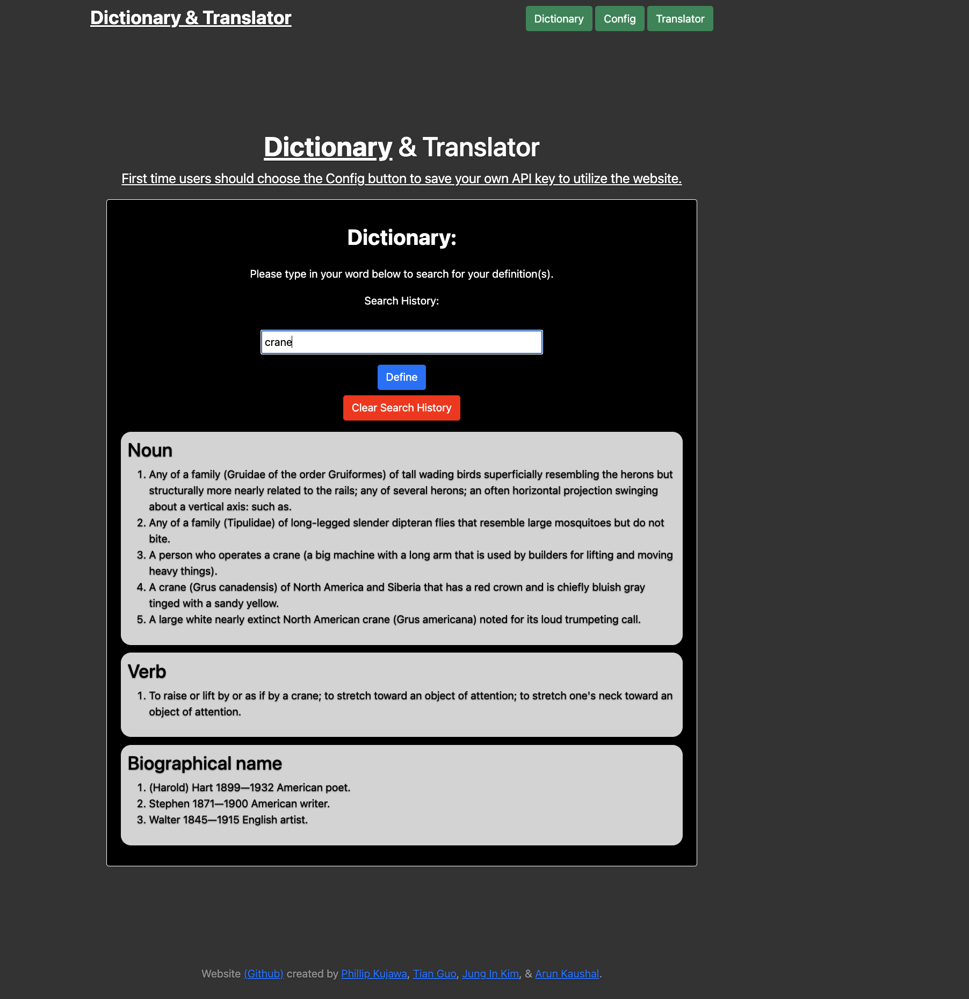
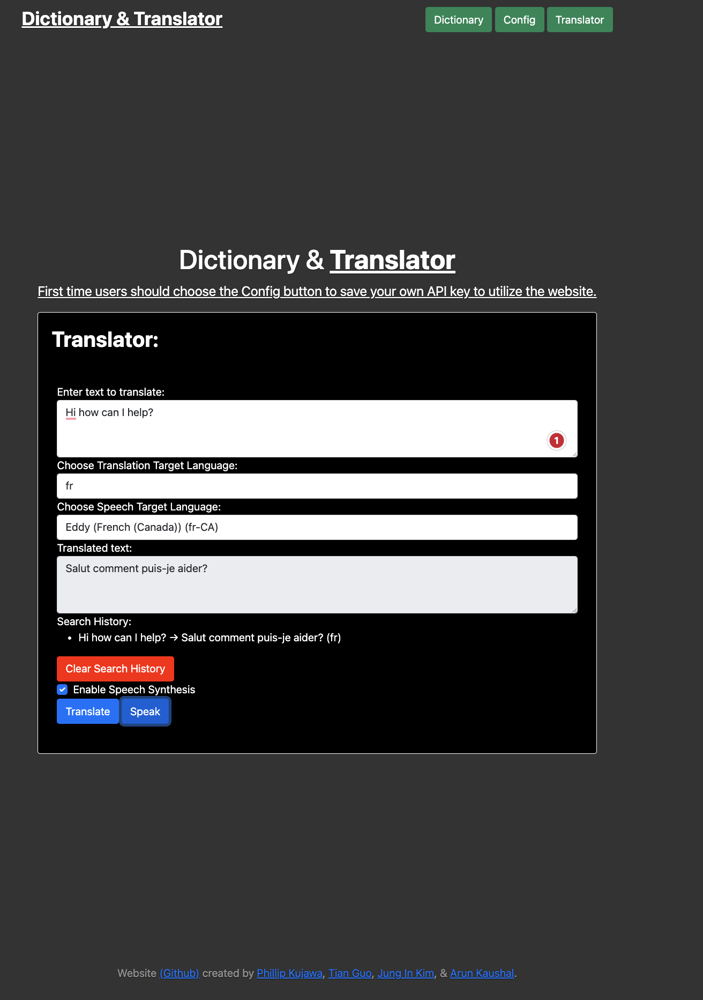
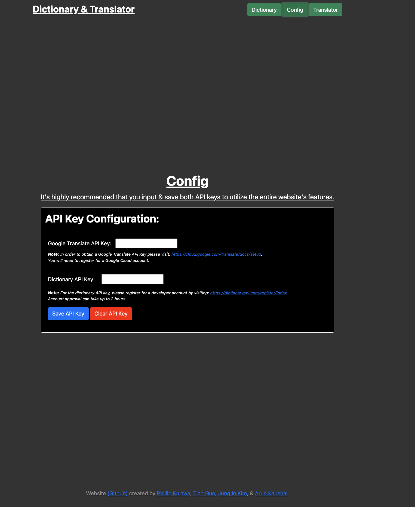

# Dictionary Translator Web Application - Project 1
## Description

Our group created a translation and dictionary web-based application. The web application entails: 

* Dictionary Translation - Ability to show nouns, verbs and adjectives 
* Translation - Ability to translate in every support language that Google Cloud Translation API supports [language list in ISO-639 format](https://cloud.google.com/translate/docs/languages). 
* Speech-to-Text - Ability to speak translated text in any language that your web browser supports. Text-to-speech language support is based on your local browser settings. 
* API Key Configuration Page - Ability to add your own Google Cloud & Dictionary API key. An API key will be provided to instructors.

## Live URL
   

Live URL Link: [Github Pages](https://phillipkujawa.github.io/dictionary-translator-project1/)

## Contributor

**Project Members:** Phillip Kujawa, Tian, Jung In Kim, Arun Kaushal, and Aldrin  
**Websites:** W3schools, stackoverflow, & reddit  
**Instructor(s):** Ali Maqsood, Daler Singh  
**Assistant Instructor(s):** Shihan, Adam, Krishna, Tareque Moatar  
**Institution:** University of Toronto  

## License

MIT License

